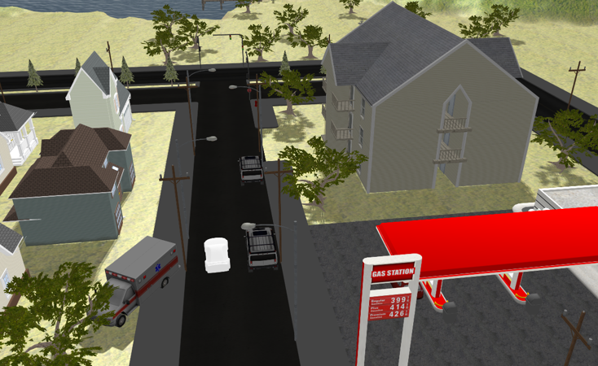
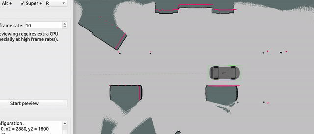

# AutoCarROS

A ROS-based autonomous car simulation project with Gazebo integration.

## Project Overview

This project implements an autonomous car simulation using ROS2 and Gazebo, featuring navigation, localization, and autonomous parking capabilities.

## Features

- **Autonomous Navigation**: Complete navigation stack with path planning and obstacle avoidance
- **Localization**: Real-time localization using sensor fusion
- **Gazebo Simulation**: Realistic physics simulation with various world environments
- **Autonomous Parking**: Advanced parking maneuver capabilities

## Demo

Watch the autonomous parking maneuver in action:

